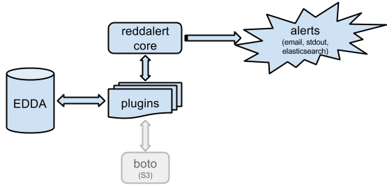

# reddalert

AWS security monitoring/alerting tool built on top of Netflix's [EDDA](https://github.com/Netflix/edda) project.

What do we want to see? Examples:
 * security group whitelists some wierd port(range)
 * ELB forwards traffic to some wierd port
 * an EC2 instance was created from an AMI not seen before
 * IAM user added to a group

## Installation

Installing and running the project is pretty simple:

```
$ virtualenv virtualenv
$ . virtualenv/bin/activate
$ pip install -r requirements.txt
$ python reddalert.py --configfile <file> --statusfile <file> rule_1 [rule_2 [...]]
```

And setup a cronjob which calls this script periodically.

### The configuration file

```reddalert``` integrates into an AWS environment. The purpose of this file is to define this environment. The minimum you need is the address of a running [EDDA] server. See ```etc/configfile_template.json``` for an example!

 * ```edda``` The address of your EDDA instance.
 * ```output``` Comma-seperated list of alerting targets. If something strange is found, ```reddalert``` can email you and eg. copy the alert into ElasticSearch. Or just prints it to standard output.
 * ```store-until``` Tipically we're only interrested in events happened since the last run. If this configuration option is ```true```, the timestamp of the actual run is stored in the status file at the end of the run. It is overridable from command line, see ```--since``` and ```--until```.
 * ```plugin.<plugin_name>``` Plugin-specific options.
 * ```es_host```, ```es_port``` If you use the ```elasticsearch``` output, define the ES address here.

For plugin-specific settings, check the plugin's documentation.

### The status file

This file is used to store the context needed by plugins between each run. You don't want to keep getting the same alert for the same AMI, do you? Well, that's why this file exists.

Furthermore, the epoch of the last run is stored here if ```store-until``` is enabled.

## Detailed Description



### Project Layout

```
[project dir]
\- api           (core files, like EDDA client lib, alerters, etc.)
\- docs          (documentation)
\- etc           (configuration files)
\- plugins       (plugins go here)
\- tests         (unit tests)
\- reddalert.py  (main executable)
```

### Plugins

For a detailed description of available plugins, check [wiki](https://github.com/prezi/reddalert/wiki).

Each plugin class is expected to have two methods, an ```init``` and a ```run```.
 * ```init``` Here are some infrastructure-level classes passed, notably:
   * ```edda_client``` EDDA "client proxy"
   * ```conifig``` The ```plugin.{plugin_name}``` part of the config file
 * ```run``` It should return the alert objects, in the following format:

    ```
    {
        "plugin_name": "identifier of this plugin",
        "id": "identifier of the alerted object, eg. security group id",
        "details": "human-readable details, eg. suspicious port range"
    }
    ```

Once you have a plugin, don't forget to add it to ```plugin_list``` in the plugin module's [init file](reddalert/plugins/__init__.py) to make it available from command line.

## How Do We Use It at Prezi?

We run it periodically every 6 hours. The alerts are sent to ElasticSearch, and from ES trac tickets are automatically created (using a different system). For a long time we received the alerts through email, which was a feasible workflow as well. After the initial fine-tuning we process about 3-5 alerts daily.

### Do you want to contribute?

Send a pull request. Tests are highly appreciated.

## See Also

[](http://en.wikipedia.org/wiki/Edda_M%C5%B1vek)
[](http://en.wikipedia.org/wiki/Command_%26_Conquer:_Red_Alert)
